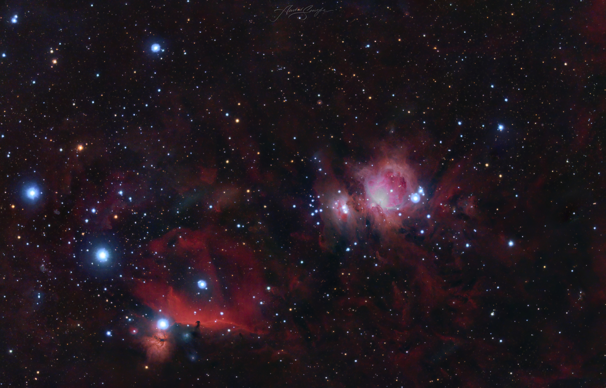

# Star Detector

### Description

This Rust program detects stars in a given photo. Although the project is not yet complete and isn't entirely reliable, you can use it to identify stars in images.

### Table of contents

1. [Installation](#installation)
2. [Dependencies](#dependencies)
3. [Usage](#usage)
4. [Tests](#tests)
5. [Ressources](#ressources)

## Installation 

**Prerequisites:**

* Rust compiler (version 1.56 or later recommended): Follow the official installation guide at [https://www.rust-lang.org/tools/install](https://www.rust-lang.org/tools/install).
* Image processing libraries: These will be automatically downloaded during the build process.

**Steps:**

1. Clone this repository:

```bash
git clone [https://github.com/Hugo-filipe14/Star-detector.git](https://github.com/Hugo-filipe14/Star-detector.git)
```
2. Navigate to the project directory:

```bash
cd Star-detector
```
3. Run the project:
```bash
cargo run --release
```

## Dependencies

This project relies on the following external libraries:
- geo: Provides geospatial data structures
- image: Handles image loading, manipulation and saving
- image-dwt: Offers discrete wavelet transform functionalities
- imageproc: Implements image processing algorithms 

These dependencies are managed using cargo, Rust's package manager. They will be automatically downloaded and linked during the build process. 


## Usage 

To detect stars in an image:
1. ** Place your image **: Save the image you want to analyze in the same directory as the program's source code.
2. ** Modify image path **: In src/main.rs, locate the line that opens the image and adjust the file path to match your image's name. By default, the code assumes the image is named m42-star-detection.jpg
```rust 
let mut image = image::open("m42-star-detection.jpg").unwrap();
```
3. ** Run the program **: Compile and run the program using cargo:
```bash
cargo run --release
```
The program will process the image and create a new file named annotated.png. This output image will visually highlight the detected stars.

## Tests

While the project is currently under development, automated tests are not yet implemented. I plan to integrate unit and integration tests in the future to ensure code reliability.

Here are basic a test I've made so far using the following image:



And here is annoted image I got from this code:


## Ressources

For a better understanding of this project's structure and the underlying concepts, consider these resources:

- Naive Star Detector Tutorial: [https://www.freecodecamp.org/news/rust-tutorial-naive-star-detector-for-images/](https://www.freecodecamp.org/news/rust-tutorial-naive-star-detector-for-images/)
